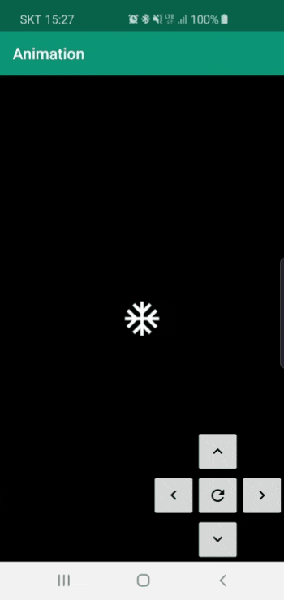
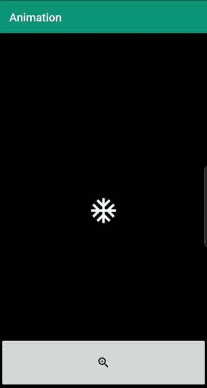

# Animation
This is sample code for "Property animation" in Android.

This code is based on the [codelab](https://codelabs.developers.google.com/codelabs/advanced-android-kotlin-training-property-animation)

I just changed the icon from the 'star' to 'snow'.

Same as the [codelab](https://codelabs.developers.google.com/codelabs/advanced-android-kotlin-training-property-animation), here are 6 examples:

1. Rotate
1. Translate
1. Scale
1. Fade
1. Color
1. Snowing

You can see the results:

## 1. Rotate 

## 2. Translate

## 3. Scale

## 4. Fade

## 5. Color

## 6. Snowing

